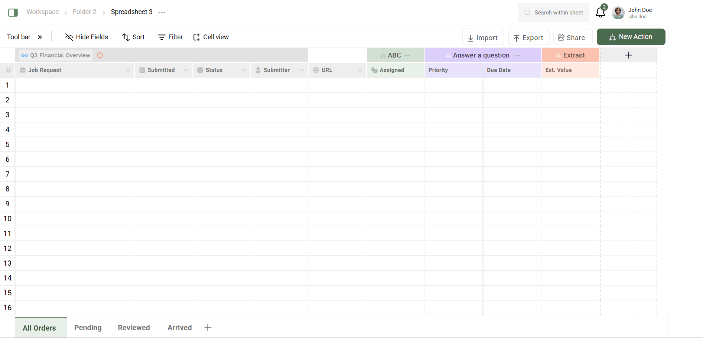

This project is a fully interactive, Excel-like spreadsheet UI built using React and Tailwind CSS. It includes editable rows and columns, custom status and priority tags, and an intuitive layout

Features:
1. Editable grid with 40 rows and 9 columns
2. Keyboard navigation (Arrow keys and Enter key)
3. Conditional cell styling for:
    Status (in-process, need to start, complete, blocked)
    Priority (high, medium, low)
4. Auto-suffix for estimated value (₹)

Tech Stack:
1. Frontend: React + TypeScript
2. Styling: Tailwind CSS
3. Icons: React Icons + Custom SVGs

Screenshots:

